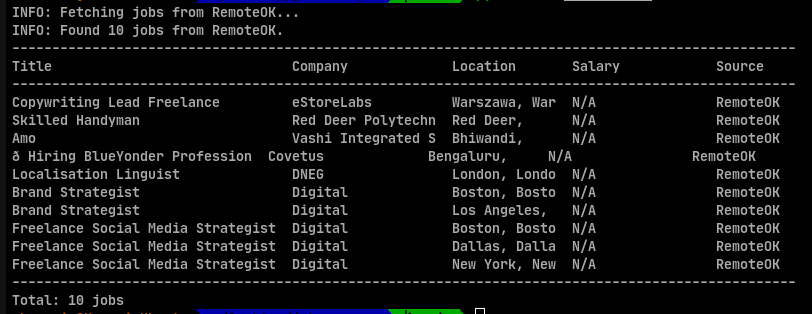

# job-scraper
## Demo


A command-line tool to scrape remote job listings, filter by keyword, and export results to CSV or JSON.

## Features

- Scrapes live job listings from RemoteOK
- Extensible: plug in any HTML job board with custom CSS selectors
- Filter results by keyword (title, company, or tags)
- Export to CSV, JSON, or formatted terminal table
- Configurable request delay to be a respectful scraper

## Installation

```bash
git clone https://github.com/yourusername/job-scraper.git
cd job-scraper
pip install -r requirements.txt
pip install -e .
```

## Usage

### Basic usage (print table to terminal)

```bash
job-scraper
```

### Filter by keyword

```bash
job-scraper --keyword python
```

### Export to CSV

```bash
job-scraper --keyword backend --format csv --output results.csv
```

### Export to JSON

```bash
job-scraper --keyword devops --format json --output results.json
```

### Limit number of results

```bash
job-scraper --limit 20
```

### All options

```
usage: job-scraper [-h] [--sources SOURCE [SOURCE ...]] [--keyword KEYWORD]
                   [--limit N] [--output FILE] [--format {csv,json,table}]
                   [--delay DELAY]

options:
  --sources    Sources to scrape (default: remoteok)
  --keyword    Filter jobs by keyword
  --limit      Max jobs per source (default: 50)
  --output     Output file path
  --format     Output format: csv, json, or table (default: table)
  --delay      Seconds between requests (default: 1.0)
```

## Extending with a custom source

```python
from job_scraper import CustomHTMLScraper

scraper = CustomHTMLScraper(
    url="https://example-jobs.com/listings",
    job_selector=".job-card",
    title_selector=".job-title",
    company_selector=".company-name",
    location_selector=".location",
    source_name="ExampleJobs",
)

jobs = scraper.fetch(limit=30)
```

## Project structure

```
job-scraper/
    job_scraper/
        __init__.py     - public API
        scraper.py      - fetching and parsing logic
        cli.py          - argument parsing and entry point
        exporter.py     - CSV, JSON, and table output
    requirements.txt
    setup.py
    README.md
```

## Requirements

- Python 3.10+
- requests
- beautifulsoup4
